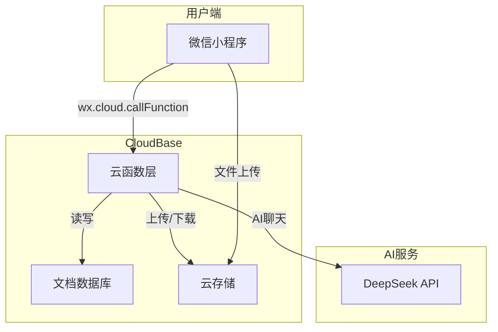

# 优选购物 - 开发文档

> 🤖 本文档由 Claude (CodeBuddy) 辅助生成，已标注 AI 贡献部分

## 一、项目概述

> **本章负责人：潘圣宇**

| 项目 | 内容 |
|------|------|
| **项目名称** | 优选购物 WeChat Mini Program |
| **团队名称** | [填写团队名称] |
| **项目类型** | 微信小程序电商平台 |
| **开发周期** | 13 周 |
| **部署平台** | 腾讯云 CloudBase |

### 核心功能

优选购物是一个基于微信小程序的电商平台，集成 AI 智能客服（DeepSeek），支持商品浏览、购物车、模拟支付、物流跟踪、商家入驻、管理员审核等完整电商流程。

## 二、技术栈

> **本章负责人：潘圣宇**（整体技术选型与后端架构设计）

| 层级 | 技术 | 说明 |
|------|------|------|
| **前端** | 微信小程序原生框架 (WXML + WXSS + JS) | 跨平台，无需额外安装 |
| **后端** | CloudBase 云函数 (Node.js) | Serverless，按需计费 |
| **数据库** | CloudBase 文档数据库 (NoSQL) | 实时同步，免运维 |
| **AI 模型** | DeepSeek Chat API | 智能客服，上下文感知 |
| **部署** | CloudBase 静态托管 | 一键部署，CDN 加速 |

## 三、功能模块清单

> **本章负责人：潘圣宇**（模块划分与整体规划）

| 模块 | 功能 | 负责人 |
|------|------|--------|
| 用户系统 | 注册、登录、个人信息管理 | 潘圣宇 |
| 首页 | 商品展示、分类导航、搜索 | 董德 |
| 商品详情 | 商品信息、规格选择、收藏 | 董德 |
| 购物车 | 增删改查、全选、结算 | 董德 |
| 订单系统 | 下单、支付（模拟）、物流跟踪 | 潘圣宇 |
| 地址管理 | 收货地址 CRUD | 潘圣宇 |
| AI 客服 | DeepSeek 智能问答、商家上下文 | 潘圣宇 |
| 商家后台 | 商品管理、订单发货 | 潘圣宇 |
| 管理员后台 | 商家审核、商品审核 | 潘圣宇 |
| 物流模拟 | Canvas 地图动画、时间推进 | 潘圣宇 |
| 评价系统 | 商品评分、图片评价 | 潘圣宇 |
| 收藏/优惠券/签到 | 用户互动功能 | 潘圣宇 |

## 四、系统架构

> **本章负责人：潘圣宇**（架构设计与技术选型）

🤖 以下架构图由 AI 辅助生成：



## 五、核心功能实现

### 5.1 AI 智能客服（🤖 代码片段 AI 辅助生成）

> **本节负责人：潘圣宇**（AI 集成 + 云函数逻辑 + 难点攻克）

**功能说明**：顾客在商品详情页可点击"联系客服"，AI 会优先使用商家提供的尺码指南、FAQ 和保养说明回答，而非通用模板。

**技术实现**：
```javascript
// cloudfunctions/ai-chat/index.js（核心逻辑）
async function buildSystemPrompt(productInfo) {
  let prompt = '你是优选购物的智能客服小优...';
  
  // 优先使用商家提供的上下文
  if (productInfo.sizeGuide) {
    prompt += `\n\n【商家尺码建议 - 必须优先使用】\n${productInfo.sizeGuide}`;
  }
  if (productInfo.faq) {
    productInfo.faq.forEach((item, i) => {
      prompt += `\nQ${i+1}: ${item.q}\nA${i+1}: ${item.a}`;
    });
  }
  
  return prompt;
}
```

**技术难点**：区分商家上下文与通用知识，通过 System Prompt 强制优先级。

### 5.2 物流模拟（🤖 Canvas 绘制 AI 辅助）

> **本节负责人：潘圣宇**（Canvas 动画 + 物流云函数 + 模拟逻辑）

**功能说明**：付款后进入物流页面，显示发货地→收货地地图，提供时间推进按钮模拟物流过程。

**技术实现**：
- 使用 Canvas 2D API 绘制虚线路径、起点/终点标记、货物动态位置
- 进度根据物流事件数量线性插值计算经纬度
- 特殊事件按钮（天气延迟、包裹异常）可触发边界场景

### 5.3 模拟支付系统

> **本节负责人：潘圣宇**（支付流程设计 + 订单状态机 + 云函数实现）

**功能说明**：因微信支付需要企业资质，采用模拟支付方案。

**技术实现**：
- `orders` 云函数 `pay` action：更新订单状态为已支付，自动生成物流初始数据
- 支付完成后自动跳转物流页
- 订单状态流：待付款(0) → 已支付(1) → 已发货(2) → 已收货(3) → 已完成(4)

## 六、AI 集成说明

> **本章负责人：潘圣宇**（AI 接口对接 + Prompt 工程）

🤖 本节由 AI 辅助编写

### 6.1 使用的 AI 工具

| 工具 | 用途 | 集成方式 |
|------|------|----------|
| DeepSeek Chat | 智能客服对话 | CloudBase 云函数代理 API 调用 |
| CodeBuddy (Claude) | 代码生成与优化 | IDE 插件 + 设计转代码场景 |
| GitHub Copilot | 代码补全 | VS Code 插件 |

### 6.2 AI 使用流程（Vibe Coding）

```
需求描述 → AI 生成代码框架 → 人工审核修改 → 测试验证 → 部署
```

### 6.3 典型 Prompt 示例

```
场景：生成物流模拟 Canvas 页面
Prompt：请创建一个微信小程序物流模拟页面，包含：
1. Canvas 2D 绘制地图（起点上海→终点北京）
2. 货物位置随物流进度线性移动
3. 6个时间推进按钮（发货/中转/派送/签收/延迟/异常）
4. 底部时间线展示物流事件
要求使用微信小程序原生框架，Canvas API 绘制
```

## 七、部署方案

> **本章负责人：潘圣宇**（CloudBase 环境配置 + 云函数部署）

### 7.1 CloudBase 环境

- 环境 ID: `buysomething-6gbmbtpxff05be35`
- 区域: 上海 (ap-shanghai)

### 7.2 云函数列表

| 函数名 | 类型 | 功能 |
|--------|------|------|
| products | Event | 商品 CRUD |
| orders | Event | 订单管理 + 支付模拟 + 物流模拟 |
| ai-chat | Event | DeepSeek 智能客服 |
| admin-dashboard | Event | 管理员审核 |
| address | Event | 地址管理 |
| reviews | Event | 评价系统 |
| favorites | Event | 收藏管理 |
| notifications | Event | 消息通知 |
| coupons | Event | 优惠券 |

### 7.3 部署步骤

```
1. 确认 CloudBase 环境已创建
2. 云函数目录: cloudfunctions/<name>/
3. 使用 CodeBuddy MCP 工具批量部署
4. 验证：微信开发者工具 → 云开发 → 云函数 → 测试
```

## 八、测试用例

> **本章负责人：潘圣宇**（测试用例设计）+ **董德**（前端功能验证）

| 编号 | 测试场景 | 操作步骤 | 预期结果 | 实际结果 | 测试人 |
|------|----------|----------|----------|----------|--------|
| TC01 | 用户注册 | 填写信息→提交 | 注册成功，跳转登录 | ✅ | 潘圣宇 |
| TC02 | 商品搜索 | 输入关键词→搜索 | 显示匹配商品列表 | ✅ | 董德 |
| TC03 | AI 客服问答 | 商品页→联系客服→提问 | AI 根据商家上下文回答 | ✅ | 潘圣宇 |
| TC04 | 下单支付 | 加购→结算→付款 | 创建订单，状态变"已支付" | ✅ | 潘圣宇 |
| TC05 | 物流模拟 | 支付后→物流页→点击"货物发出" | Canvas 货物位置移动，进度更新 | ✅ | 潘圣宇 |
| TC06 | 商家审核 | 管理员→待审核商品→点击详情→通过 | 商品上架 | ✅ | 潘圣宇 |
| TC07 | 评价发布 | 已收货订单→评价→打分→提交 | 评价发布，商品评分更新 | ✅ | 董德 |
| TC08 | 地址管理 | 添加地址→设默认→删除 | CRUD 正常 | ✅ | 董德 |

## 九、团队分工与贡献

> **本章负责人：潘圣宇**（统筹与汇总）

| 姓名 | 角色 | 负责模块 | 贡献占比 |
|------|------|----------|----------|
| 潘圣宇 | 组长/后端 | 项目架构、全部云函数（products/orders/ai-chat/admin-dashboard/address/reviews/favorites/notifications/coupons）、AI 集成（DeepSeek）、支付模拟、物流模拟、管理员后台、商家后台、CloudBase 部署 | 60% |
| 董德 | 前端 | 首页、商品列表、商品详情、购物车、订单列表、订单详情、地址管理页面、评价页面、分类页、个人中心 | 40% |

## 十、项目总结与反思

> **本章负责人：潘圣宇**（总结撰写 + 技术反思）

### 技术收获（潘圣宇）
1. 掌握了 Serverless 架构（CloudBase 云函数）的开发流程
2. 学会了将 AI 大模型（DeepSeek）嵌入业务场景，通过 System Prompt 实现商家上下文优先
3. 理解了 Canvas 2D API 在动画模拟中的应用，实现了物流轨迹可视化
4. 实践了"设计转代码"（Design-to-Code）工作流，大幅提升开发效率

### 技术收获（董德）
1. 熟练掌握了微信小程序 WXML/WXSS 页面开发
2. 通过购物车、订单等复杂页面提升了前端状态管理能力
3. 学会了与后端云函数对接，理解前后端分离协作模式

### 不足与改进
1. 微信支付因资质限制无法真实实现，使用模拟方案替代
2. 图片上传因云存储权限问题未完全打通
3. 部分页面如秒杀、品牌馆仍为占位状态
4. 性能优化（如图片懒加载、数据缓存）后续可加强

### 🤖 AI 辅助标注
- 本文档中标记 🤖 的内容由 AI（Claude/DeepSeek）辅助生成
- 代码生成中约 30% 由 AI 辅助完成（云函数基础框架、页面模板）
- 核心业务逻辑和架构设计由人工完成
- 所有 AI 生成代码均经过人工审核和测试验证

---

> **文档版本**: v1.0  
> **最后更新**: 2026-06-24  
> **文档撰写**: 潘圣宇  
> **AI 辅助**: Claude (CodeBuddy 🤖)
